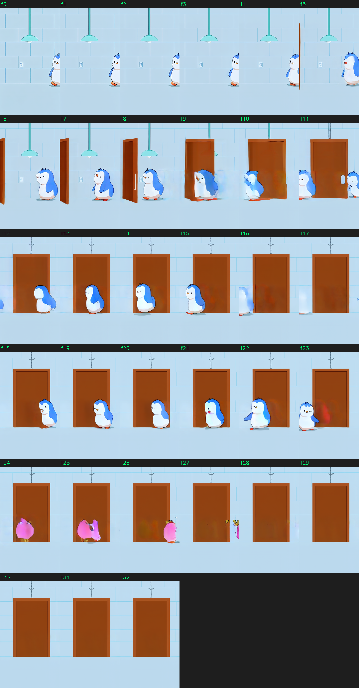
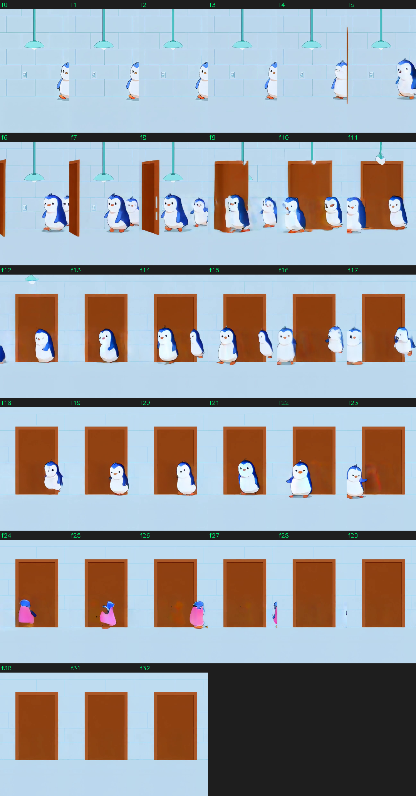
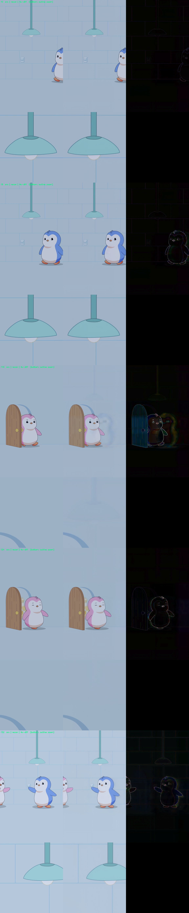

# Pudgy LoRA — Findings (Run v1 + Phase-0 diagnostics + base-model exploration)

Consolidated record of the first end-to-end CogVideoX1.5-5B-I2V LoRA run, the code fixes it
required, the quality assessment of its outputs, the Phase-0 diagnostics from
[`Training_Approach_v2.md`](Training_Approach_v2.md), and the base-model exploration that feeds
Gate G0 / Phase 1.

> **TL;DR.** The trainer had four real bugs (now fixed); the run completed cleanly and the LoRA
> **learned the Pudgy style and Pax/Polly identity in the first ~5 frames**, but every checkpoint
> **loses the character mid-clip** (drift → vanish) — a *temporal/scene* failure, not a style one.
> A VAE round-trip proves the **VAE is not the quality ceiling** (PSNR ~38 dB, SSIM ~0.996), so the
> problem is the **generation path**: CogVideoX1.5's hard **432×768 portrait cap** + attention-only
> recipe + free-I2V drift. The fix is architectural (per v2): migrate base to **Wan2.2-A14B or
> AniSora V3** (8× VAE, native portrait, keyframe-interpolation to pin identity), not more tuning.

---

## 1. Code fixes (all committed)

| # | Bug | Symptom | Fix |
|---|---|---|---|
| 1 | **Checkpoints not saved** — the per-step save block was commented out; the active per-epoch save wrote `checkpoint-checkpoint{N}`, which crashed the total-limit pruning (`int("checkpoint1")` → ValueError) on the 2nd save. | Only one checkpoint ever survived. | Restored **step-based** saving every `--checkpointing_steps` via `_save_checkpoint()`; correct `checkpoint-<step>` naming; working pruning; removed the broken per-epoch block. |
| 2 | **Resolution crash** — the launch script used `--*_sample_size=768` → portrait clips bucket to 576×1008 → rotary grid **63 > 48** cap. | `Expected size 63 but got 48` (the "expectation thing"). | Set `592` → **432×768** (grid 48×27), the **max on-grid** portrait resolution for CogVideoX1.5. Documented the ceiling. |
| 3 | **LoRA barely applied** — inference used `fuse_lora(lora_scale=1/lora_rank)` (≈0.008). | LoRA had almost no visible effect. | Use `lora_alpha/rank` (= 0.5). New `eval_pudgy_lora.py` applies the correct scale; fixed `predict_i2v.py` / `cli_demo.py`. |
| 4 | **`batch_size>1` crash** — `torch.stack` was indented *inside* the collate per-example loop. | `'Tensor' object has no attribute 'append'` at batch 2. | Dedented the stack out of the loop → enabled `train_batch_size=2` (fills the 40 GB card). |
| + | **VAE-decode OOM** at inference on 40 GB. | OOM after the 50 diffusion steps. | `eval_pudgy_lora.py` now enables VAE tiling/slicing unconditionally. |

New tooling added: `inference/eval_pudgy_lora.py` (auto-latest-checkpoint inference, correct scale,
grid-safe resolution), `inference/training_report.py` (per-frame consistency + montage + report),
`inference/compare_checkpoints.py` (one-load multi-checkpoint sweep), `inference/vae_roundtrip.py`
(Phase-0.1 VAE test).

---

## 2. Training run v1

| | |
|---|---|
| Base | `THUDM/CogVideoX1.5-5B-I2V` (local) |
| Data | 75 clips, 768×1360 portrait, 33 frames, 16 fps |
| Resolution (trained) | **432×768** (max on-grid for portrait) |
| LoRA | rank 64, α 32, **attention-only** (`to_q/k/v/out`), dropout 0 |
| Optim | AdamW, lr 3e-5 cosine, 200 warmup |
| Batch | 2 × grad-accum 2 = **effective 4** |
| Schedule | **2500 steps**, checkpoint every 250 (10 kept) |
| Result | completed in **9h39m**, 0 errors, final loss **0.0294**, GPU ~40 GB @ 100% |

Exact command captured at launch: `finetune/output_dir/pudgy-lora-v1/report/run_command.txt`.

---

## 3. Output quality assessment

Every checkpoint generated from the same conditioning frame (frame 0 of `train/00000001.mp4`),
seed 42, scale 0.5, 432×768, 33 frames. Full per-frame tables + all montages live in
`finetune/output_dir/pudgy-lora-v1/report/REPORT.md` (gitignored; local).

**Systematic pattern across all 7 checkpoints (250–2500):**
- **f0–f5:** excellent — on-model Pax, thick outlines, flat pastel, lamp + tiled wall faithful.
- **f6–f11 ("door opens"):** degradation begins — bodies smear, the door renders as an oversized slab.
- **f24–f32:** the **subject vanishes** → empty room + door.

This is **temporal/scene** failure (free I2V has nothing pinning the character mid-clip), **not** a
style failure — the LoRA clearly learned the look and both characters early.

| Ckpt | Pax identity (f0–f23) | Polly | Ends with subject? | Notes |
|---|---|---|---|---|
| 750 | clean blue | faint | no | ❌ background drifts pink |
| 1000 | **crisp blue** | no | vanishes ~f24 | strong first ⅔ |
| 1250 | ⚠️ black-patched | clear | no | color drift |
| 1500 | ⚠️ black-patched | no | persists to f32 | best retention, off-model color |
| 1750 | clean blue | attempts | vanishes ~f29 | ≈ 2000 |
| **2000 (golden)** | **cleanest blue** | attempts | vanishes ~f29 | best all-around |
| 2500 (final) | clean early | brief | vanishes ~f28 | overfit tail |

**🏆 Golden checkpoint: 2000.** A `--lora_scale 0.4` test on it **fixed the door geometry** (proper
door with a knob vs oversized slab) but **did not** stop the subject vanishing → confirms the empty
tail is a scene/horizon problem, not a LoRA-strength one.

Client-relevant limits confirmed: **no character consistency across the clip**, output is only
**2 s**, and the penguins drift from the conditioning frame.

---

## 4. Phase-0.1 diagnostic — VAE round-trip (the key gate result)

Encode→decode real clips through the CogVideoX VAE at full **768×1360**, no diffusion
(`inference/vae_roundtrip.py`). Details in [`phase0_diagnostics.md`](phase0_diagnostics.md).

| Clip | PSNR | SSIM |
|---|---|---|
| Pax (`00000001`) | **38.9 dB** | **0.996** |
| Polly (`00000065`) | **38.3 dB** | **0.995** |

Reconstructions are visually indistinguishable — crisp outlines, clean flat fills, rosy cheeks
intact; the 4×-amplified diff is near-black.

**→ The VAE is NOT the ceiling.** An 8× VAE represents the Pudgy 2D style near-losslessly, so the
bad output is a **generation/diffusion** problem, not representation. We are free to keep an 8× VAE;
only the **16× Wan2.2-5B VAE** is a risk for outline softening.

---

## 5. Base-model exploration (Gate G0 / Phase 1)

Full write-up + sources in [`base_model_exploration.md`](base_model_exploration.md). Summary:

| | Wan2.2 **I2V-A14B** | Wan2.2 **TI2V-5B** | **AniSora V3** |
|---|---|---|---|
| VAE | **8× ✅** | 16× ⚠️ softens outlines | 8× ✅ |
| Portrait 768×1360 | ✅ (no rotary cap) | ✅ | ✅ |
| Identity-pinning | FLF2V (community) | limited | **native keyframe interp ✅** |
| Style fit | general, high quality | general | **anime/2D-native ✅** |
| Params / VRAM | 14B active; wants ≥80 GB (fp8+block-swap → 16–24 GB) | 5B; 8–12 GB | 14B; fp8/offload |
| License | Apache-2.0 | Apache-2.0 | Apache-2.0 |

**Recommendation:** migrate to **Wan2.2-I2V-A14B** (quality + mature musubi-tuner tooling) or
**AniSora V3** (anime-native + built-in keyframe interpolation = the v2 plan's identity-pinning
primitive). Avoid the 5B's 16× VAE for this outline-heavy style.

**⚠️ Hardware:** this box is **A100-40 GB**. 14B-active models train here only with **fp8 +
block-swapping** (tight/slow); an **80 GB H100** is strongly preferred for A14B/AniSora.

---

## 6. Recommended next steps (aligned with v2 plan)

1. **Cross-VAE round-trip** (cheap, decisive): run `vae_roundtrip.py` against the Wan 8× vs Wan2.2
   16× VAEs to confirm the 16× outline penalty before committing hardware.
2. **Phase 0.3 — all-linear + MLP LoRA (α=2r)** on current CogVideoX: cheapest recipe test; our run
   was attention-only (`get_linear_layers()` already exists in the trainer).
3. **Phase 0.2 — caption A/B**: rare-token identity + variable-only vs the current dense captions.
4. **Phase 1 — base migration** to Wan2.2-A14B / AniSora with **FLF2V / keyframe interpolation** to
   pin identity at both endpoints (the real fix for the mid-clip drift).

---

## 7. Artifact index

| Artifact | Location | Tracked? |
|---|---|---|
| This findings doc | `training_approach/FINDINGS.md` | ✅ |
| VAE diagnostics log | `training_approach/phase0_diagnostics.md` | ✅ |
| Base-model exploration | `training_approach/base_model_exploration.md` | ✅ |
| Key montages | `training_approach/assets/*.png` | ✅ |
| Full run report (per-frame tables) | `finetune/output_dir/pudgy-lora-v1/report/REPORT.md` | ❌ local (output_dir gitignored) |
| Generated videos / all montages / frames | `finetune/output_dir/pudgy-lora-v1/report/` | ❌ local |
| Checkpoints (250–2500) + final weights | `finetune/output_dir/pudgy-lora-v1/` | ❌ local (weights gitignored) |
| Tools | `inference/{eval_pudgy_lora,training_report,compare_checkpoints,vae_roundtrip}.py` | ✅ |
